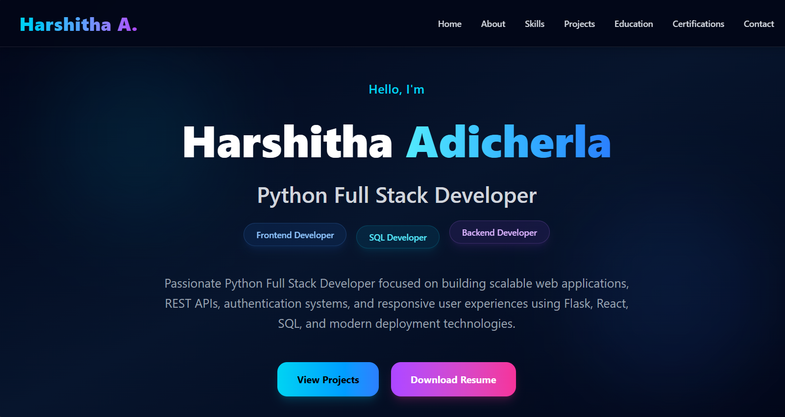
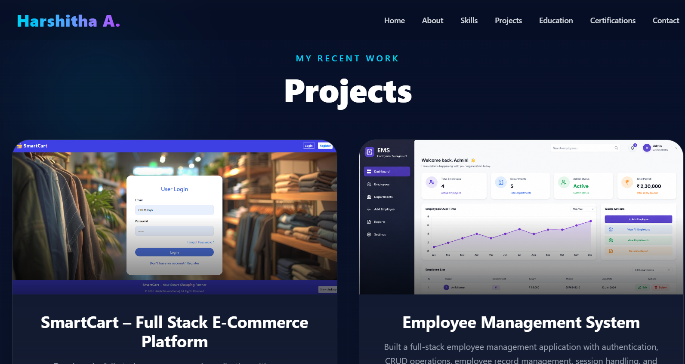
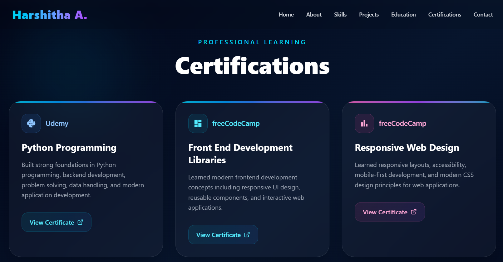

# 🚀 Harshitha React Portfolio

A modern and responsive developer portfolio website built using **React.js**, **Tailwind CSS**, and **Vite** showcasing projects, certifications, technical skills, and full stack development expertise.

---

## ✨ Features

- Modern UI/UX Design
- Fully Responsive Layout
- Animated Glassmorphism Effects
- Mobile Responsive Navbar
- Smooth Hover Animations
- Projects Showcase
- Certifications Section
- Education Timeline
- Contact Section
- Resume Download CTA
- Optimized Performance

---

## 🛠️ Tech Stack

### Frontend
- React.js
- Tailwind CSS
- JavaScript
- Vite

### Libraries & Tools
- React Icons
- CSS Animations
- Responsive Design

---

## 📂 Sections Included

- Hero Section
- About
- Skills
- Projects
- Certifications
- Education
- Contact
- Footer

---

## 📸 Screenshots

### Hero Section


### Projects Section


### Certifications Section


---

## 🚀 Installation & Setup

Clone the repository:

```bash
git clone https://github.com/your-username/harshitha-react-portfolio.git
cd harshitha-react-portfolio
```

Install dependencies:

```bash
npm install
```

Run the development server:

```bash
npm run dev
```

Build for production:

```bash
npm run build
```

---

## 🌐 Responsive Design

The portfolio is fully optimized for:

- Mobile Devices
- Tablets
- Laptops
- Desktop Screens

---

## 📌 Future Improvements

- Dark/Light Theme Toggle
- Framer Motion Animations
- Blog Section
- Live Project Deployment Links
- Advanced UI Interactions

---

## 👩‍💻 Author

**Harshitha Adicherla**

- GitHub: https://github.com/harshithaadicherla10
- LinkedIn: https://linkedin.com/in/harshithaadicherla10

---

## ⭐ Support

If you like this project, give it a ⭐ on GitHub!
